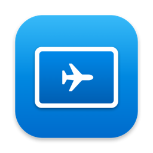

# Sidecar Travel

Turn your headless Mac (mini) into a portable workstation: plug in your iPad over
USB and it **automatically becomes the Mac's display** via Sidecar — no monitor needed.

Built for taking a Mac mini on the road. Power it on without a screen, plug in your
iPad, and you have a display.



## What it does

A tiny SwiftUI menu app that wires up macOS Sidecar for headless/travel use:

- **Auto-connect on plug** — a `launchd` trigger fires when you connect the iPad over
  USB and starts Sidecar automatically.
- **Auto-login** — optionally enables macOS auto-login for the current user, so the Mac
  boots straight into your session with no screen attached.
- **Keep a screen when headless** — a Mac with no display has no framebuffer, so screen
  sharing (VNC) shows black and there's nothing for Sidecar to extend. This option holds
  a [BetterDisplay](https://github.com/waydabber/BetterDisplay) virtual screen alive so
  there's always a picture. It **reacts to display changes instead of polling**, and stays
  completely idle while a real monitor is plugged in — so you can leave it on at home
  without your HDMI monitor re-syncing every few minutes.
- **Run at login** — starts the app in the background after a reboot, so the screen exists
  before you're there to open anything.

## Status panel

| Indicator | Meaning |
|---|---|
| iPad connected | Sidecar session is active on the selected iPad |
| iPad available | iPad is reachable and can be connected |
| Auto-connect trigger installed | the `launchd` agent is loaded |
| Keeper idle / active | whether the screen keeper is standing back (monitor present) or holding a virtual screen (headless) |

## Requirements

- A Mac and an iPad that both support **Sidecar** (iPadOS 13+, macOS 11+).
- The two devices signed into the **same Apple ID**, with Sidecar working at least once
  over Wi-Fi/USB the normal way.
- For headless boot: **FileVault off** (so the Mac can boot without typing a password)
  and auto-login set once via System Settings.
- For "keep a screen when headless": **[BetterDisplay](https://github.com/waydabber/BetterDisplay)**
  installed (`brew install --cask betterdisplay`). Optional — the rest works without it.

## Install

### Homebrew (recommended)

```sh
brew install --cask zonya/tap/sidecar-travel
```

### Manual

Download the latest `Sidecar Travel.app` from
[Releases](https://github.com/zonya/sidecar-travel/releases), move it to
`/Applications`, then **right-click → Open** the first time (the app is ad-hoc signed,
so Gatekeeper asks for confirmation once).

## First-time setup (do this while you have a screen)

1. Open the app, pick your iPad from the dropdown.
2. Click **Install trigger** — this installs the `launchd` agent that auto-connects on plug.
3. Toggle **Auto-login** on. If macOS auto-login was never configured, set it once:
   *System Settings → Users & Groups → "Automatically log in as" → your user*, then
   flip the switch again.
4. Toggle **Sidecar on plug** on.

When both auto-login and the trigger are armed you'll see **"Ready to travel."**

## On the road

1. Power off the Mac, take it with you.
2. At the destination: power on → wait for auto-login → plug in the iPad over USB.
3. Sidecar starts and the iPad becomes your screen.
4. Back home: turn both switches off (auto-login off is safer).

> Tip: a 1st-gen Apple Pencil or a small Bluetooth mouse gives you full pointer control
> on the iPad. Native finger touch is limited to gestures.

## How it works

- `ctl.js` drives the **private `SidecarCore` framework** (`SidecarDisplayManager`) via
  JavaScript for Automation to list/connect/disconnect Sidecar devices.
- The app writes a `LaunchAgent` plist with an **IOKit USB matching** rule on your iPad
  (Apple vendor id + the iPad's product id, auto-detected). On plug, `on-plug.sh` runs,
  checks the armed flag and device, and connects.
- The **screen keeper** registers a `CGDisplayRegisterReconfigurationCallback` and, on
  each settled display change, decides in one place: if a physical monitor is online
  (any display that isn't a BetterDisplay virtual screen or a Sidecar/AirPlay display) it
  does nothing; otherwise it ensures exactly one attached virtual screen and breaks any
  mirror. No timer, so nothing happens on its own while you're plugged into a monitor.
- **Run at login** is a second `LaunchAgent` that launches the app with `--background`
  (accessory activation policy, no window, `KeepAlive`).
- Config lives in `~/Library/Application Support/SidecarTravel/` (`keepscreen` flag,
  `screen.log`).

## Caveats

- `SidecarCore` is a **private Apple framework** — a major macOS update could break it.
- The app is **ad-hoc signed**, not notarized. Gatekeeper will warn on first launch.
- Built and tested on a Mac mini 2018 (macOS Sequoia).

## Build from source

```sh
git clone https://github.com/zonya/sidecar-travel
cd sidecar-travel
./build.sh          # produces build/Sidecar Travel.app
```

No Xcode project — just `swiftc` + bundle assembly.

## Localization

UI strings live in `Resources/<lang>.lproj/Localizable.strings`. English (base) and
Serbian ship today. **PRs adding new languages are welcome** — copy `en.lproj` to a new
`<lang>.lproj`, translate the values, and add the code to `CFBundleLocalizations` in
`Info.plist`.

## License

MIT — see [LICENSE](LICENSE).
